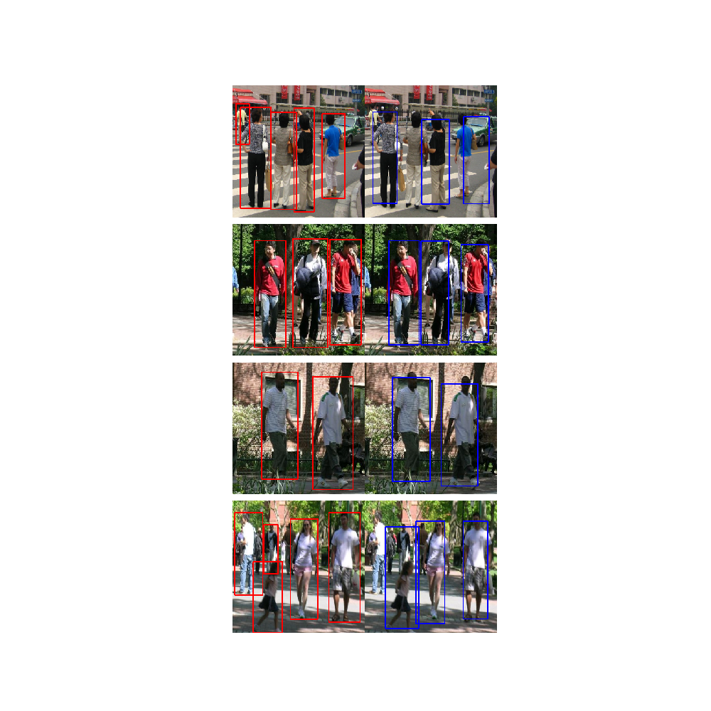

# single-shot-detector
single shot detection Algorithm with ResNet18 and FPN(Feature pyramid network) from scratch to detect human beings in a image.

go through Single-Stage-Object-Detection.ipynb notebook for more details

Neural network Architecture (ResNet with FPN and Detector(bounding box along with classification)) - 1-Detector-NN-Architecture.ipynb

Anchor boxes used for proposals and their implementation - 2-Generating-Anchor-Boxes.ipynb
Anchor boxes Matching with ground truth - 3-Matching-Predictions-with-Ground-Truth.ipynb
Loss Function Implementation - 4-Loss-Function.ipynb
Model Training & Evaluation - 5-Experiment.ipynb

Results:

